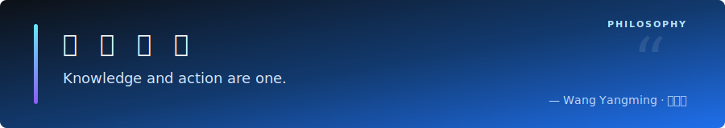



[;Lyu%20Bingrong%20wishes%20you%20a%20great%20day!&center=true&size=27)](https://git.io/typing-svg)

<picture>
  
</picture>

&nbsp;

  &nbsp;
  &nbsp;
  &nbsp;
  

<!--   my-header-img -->

👋 Hi there! I'm **Lyu Bingrong (吕炳荣)**, a Software Engineering Undergraduate 👨‍💻 who loves cutting-edge Artificial Intelligence & Machine Learning. 

🚀 Software Engineering | Large Language Model (LLM) Enthusiast | AI Application Developer

🌟 Dedicated to LLM exploration, intelligent applications, and model evaluation. My recent explorations cover state-of-the-art models including **ChatGPT**, **Gemini**, and **Claude**.

💼 **Past Experience**: Participated in Large Language Model (LLM) evaluation-related work at the **Beijing Academy of Artificial Intelligence (BAAI / 北京智源人工智能研究院)**.

### 📫 Connect with me

  
  
  
  

<!--   my-skils -->

### 👨‍💻 Languages & Tools

  

### 🧠 AI & Machine Learning

  

### 🤖 LLMs & Domain Expertise

  
  
  
  

  
  
  
  

 

## 📜 Philosophy / 个人准则

  

 

## 🏆 Honors & Achievements / 荣誉与奖项

| 🏅 **Award Level** / 奖项级别 | 🎯 **Competition** / 竞赛成就 | 🗓️ **Date** |
| :--- | :--- | :---: |
| 🥇 **National 1st Prize**   国家级一等奖 | **19th "Challenge Cup" National College Student Academic Science Competition - "AI" Special Track**   第十九届“挑战杯”全国大学生课外学术科技作品竞赛“人工智能”专项赛 | <kbd>&nbsp;2025&nbsp;</kbd> |
| 🥉 **National Bronze Award**   国家级铜奖 / 三等奖 | **China International College Students' Innovation Competition**   中国国际大学生创新大赛 | <kbd>&nbsp;2024&nbsp;</kbd> |
| 🥉 **National 3rd Prize**   国家级三等奖 | **16th Chinese College Students Service Outsourcing Innovation and Entrepreneurship Competition**   第十六届中国大学生服务外包创新创业大赛 | <kbd>&nbsp;2025&nbsp;</kbd> |
| 🥉 **Global Final 2nd Runner-up**   全球总决赛季军 | **6th Zhongguancun Talent Maker Competition**   第六届中关村人才创客大赛 | <kbd>&nbsp;2024&nbsp;</kbd> |
| 🥉 **Kaggle Bronze Medal**   Kaggle 铜牌 | **Kaggle - Deep Past Challenge - Translate Akkadian to English**   Kaggle 竞赛 - 深度古代挑战赛（阿卡德语翻译） | <kbd>2026.03</kbd> |

 

## 📊 GitHub Analytics

  

  

 

### 🐍 GitHub Contributions

<picture>
  <source media="(prefers-color-scheme: dark)" srcset="https://raw.githubusercontent.com/YOIMIYA66/YOIMIYA66/output/github-contribution-grid-snake-dark.svg">
  <source media="(prefers-color-scheme: light)" srcset="https://raw.githubusercontent.com/YOIMIYA66/YOIMIYA66/output/github-contribution-grid-snake.svg">
  
</picture> 

 
 

